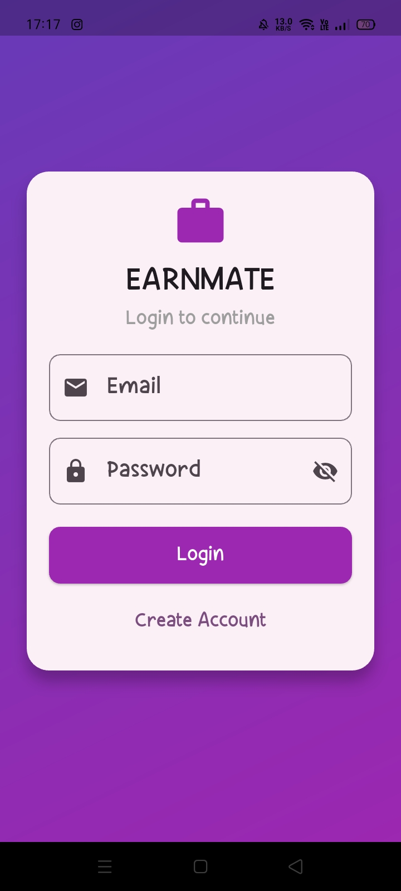
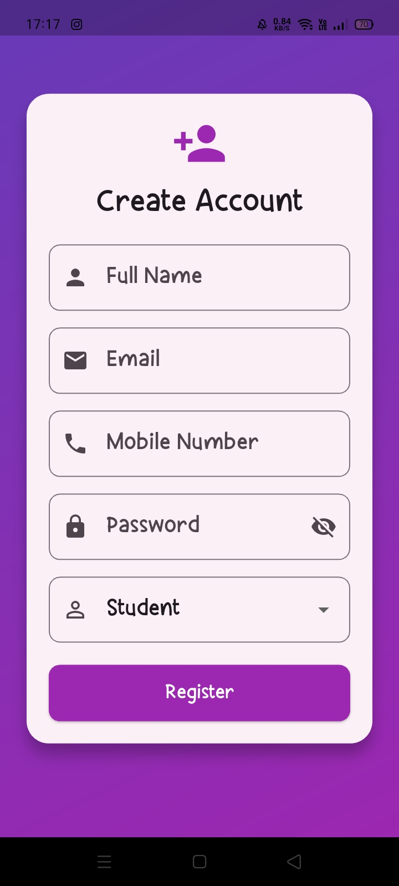
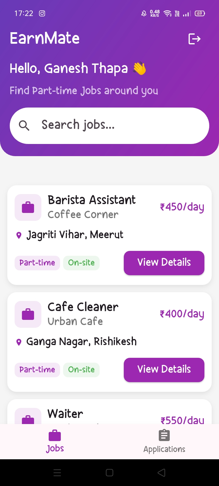
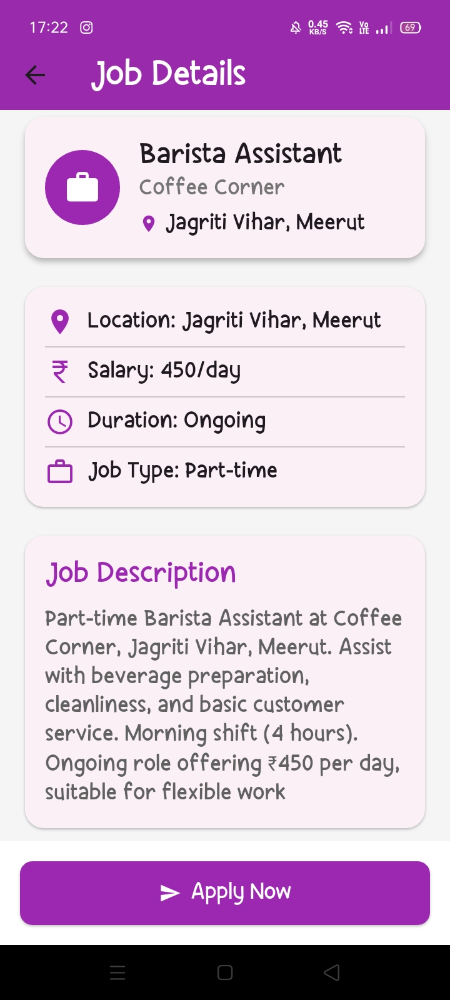
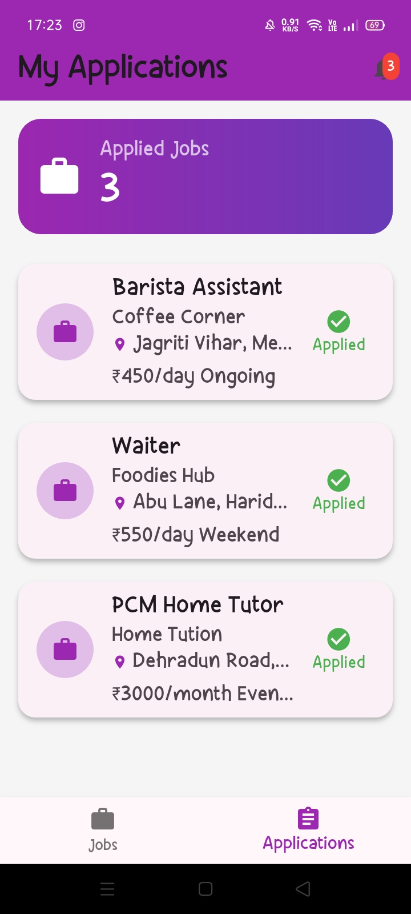
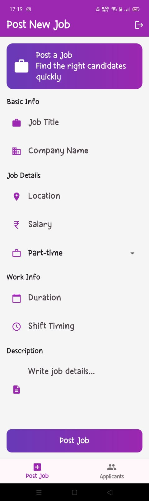
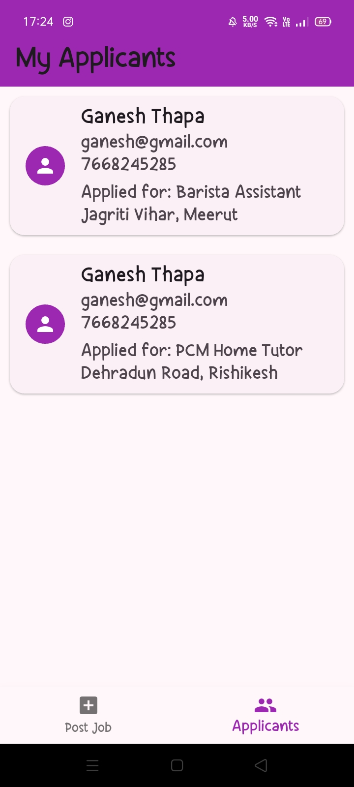

# EarnMate - Part-Time Job Portal

EarnMate is a Flutter-based part-time job portal that connects students seeking flexible work opportunities with employers looking to hire part-time staff. The application uses Sqflite for local database management and provides separate workflows for students and employers through role-based authentication.

## Features

### Authentication

* User Registration
* User Login
* Role-Based Access Control
* Session Management Support

### Student Module

* Browse Available Jobs
* Search Jobs by Title, Company, Location, or Type
* View Detailed Job Information
* Apply for Jobs
* Track Applied Jobs

### Employer Module

* Post New Jobs
* View Applicants for Posted Jobs
* Access Applicant Contact Information

### Database Management

* Local Database using Sqflite
* User Management
* Job Management
* Application Tracking

## Tech Stack

* Flutter
* Dart
* Sqflite
* Shared Preferences
* Material Design

## Database Structure

### Users Table

* id
* name
* email
* password
* role
* mobile

### Jobs Table

* id
* title
* company
* location
* salary
* type
* duration
* shift_timing
* description
* employer_id

### Applications Table

* id
* user_id
* job_id

## Project Architecture
lib/
- student_side
    - job_details.dart
    - job_model.dart
    - myapplications.dart
    - stu_dashboard.dart
    - stu_home.dart
    - user_model.dart

- employers_side
    - emp_dashboard.dart
    - job_post_screen.dart
    - my_applicants.dart

- login.dart
- register.dart
- main.dart
- db_helper.dart
- routes.dart
- splash.dart

## Application Preview

### Login Screen

### Registration Screen

### Student Dashboard

### Job Details

### My Applications

### Employer Dashboard

### Applicants Screen

## Future Improvements

* Firebase Authentication
* Cloud Database Integration
* Job Categories & Filters
* Employer Profile Management
* Push Notifications
* Resume Upload Feature

## Learning Outcomes

This project helped in understanding:

* Flutter UI Development
* State Management with Stateful Widgets
* Local Database Operations using Sqflite
* CRUD Operations
* Navigation & Routing
* Role-Based Authentication
* Session Management
* App Architecture Design

## Author

Developed by Aaditya Keshi

If you found this project useful, feel free to star the repository.